## Part 1. Инструмент ipcalc
1.1 Сети и маски
* Адрес сети 192.167.38.54/13:192.160.0.0(для этого применяем & побитово маску к IP)
-  Перевод маски 255.255.255.0 в префиксную и двоичную запись:
* Префиксная:/24(первые 24 бита единицы)
* Двоичная 11111111.11111111.11111111.00000000
- /15 в обычную и двоичную:
* Обычная: 255.254.0.0.
* Двоичная: 11111111.11111110.00000000.00000000.
 11111111.11111111.11111111.11110000 в обычную и префиксную:
* 255.255.255.240
* /28
- Минимальный и максимальный хост в сети 12.167.38.4 при масках: /8, 11111111.11111111.00000000.00000000, 255.255.254.0 и /4:
* Маска /8:
* Адрес сети: 12.0.0.0.
* Минимальный хост: 12.0.0.1 (первый доступный IP после адреса сети).
* Максимальный хост: 12.255.255.254 (последний доступный IP перед широковещательным адресом).
* Маска 11111111.11111111.00000000.00000000 (/16):
* Адрес сети: 12.167.0.0.
* Минимальный хост: 12.167.0.1.
* Максимальный хост: 12.167.255.254.
* Маска 255.255.254.0 (/23):
* Адрес сети: 12.167.38.0.
* Минимальный хост: 12.167.38.1.
* Максимальный хост: 12.167.39.254.
* Маска /4:
* Адрес сети: 0.0.0.0 (первые 4 бита фиксированы, а в IP 12.167.38.4 первые 4 бита — 0000).
* Минимальный хост: 0.0.0.1.
* Максимальный хост: 15.255.255.254.  

1.2. localhost
- Все IP-адреса в диапазоне 127.0.0.0/8 (от 127.0.0.0 до 127.255.255.255) являются loopback-адресами. Это означает, что любой IP-адрес в этом диапазоне будет указывать на локальную машину.
* Можно обратиться: 127.0.0.2, 127.1.0.1.
* Нельзя обратиться: 194.34.23.100, 128.0.0.1.  

1.3. Диапазоны и сегменты сетей
- Частные IP-адреса используются внутри локальных сетей и не маршрутизируются в интернете. Они определены в следующих диапазонах:
* 10.0.0.0/8 (10.0.0.0 – 10.255.255.255)
* 172.16.0.0/12 (172.16.0.0 – 172.31.255.255)
* 192.168.0.0/16 (192.168.0.0 – 192.168.255.255)  

Проверка IP-адресов:
* Частные IP:
* 10.0.0.45
* 192.168.4.2
* 172.20.250.4
* 172.16.255.255
* 10.10.10.10
* Публичные IP:
* 134.43.0.2
* 172.0.2.1
* 192.172.0.1
* 172.68.0.2
* 192.169.168.1

Возможные IP-адреса шлюза для сети 10.10.0.0/18
* Возможные шлюзы:
* 10.10.0.2
* 10.10.10.10
* 10.10.1.255
* Невозможные шлюзы:
* 10.0.0.1
* 10.10.100.1
## Part 2. Статическая маршрутизация между двумя машинами
- 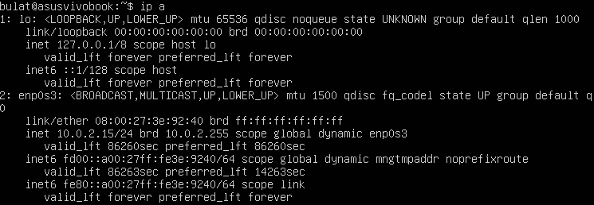
* Вывод ip a ws1
- 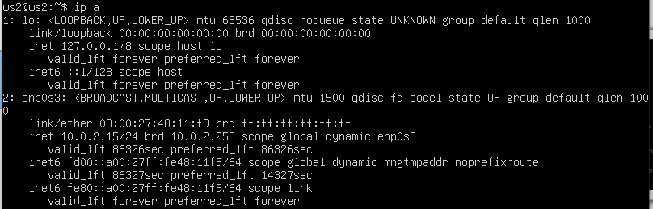
* Вывод ip a ws2
- 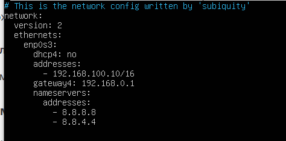
* задание интерфейса ws1
- 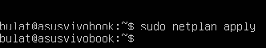
* перезапуск сервиса сети ws1
- 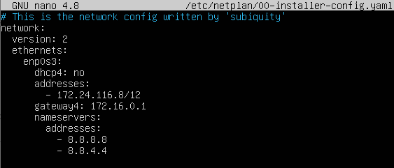
* задание интерфейса ws2
- 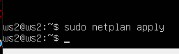
* перезапуск интерфейса ws2  

2.1. Добавление статического маршрута вручную
- 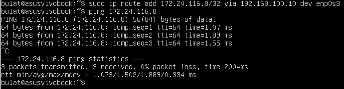
* добавление статического маршрута и пропинговка ws1
- 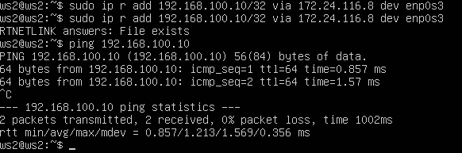
* добавление статического маршрута и пропинговка ws2  

2.2. Добавление статического маршрута с сохранением
- 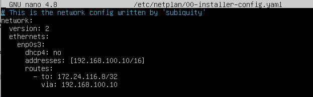
* измененный файл /etc/netplan/00-installer-config.yaml для ws1
- 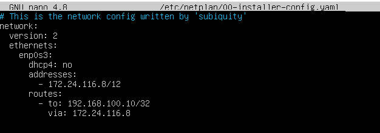
* измененный файл /etc/netplan/00-installer-config.yaml для ws2
- 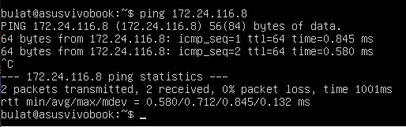
* пропинговка ws1
- 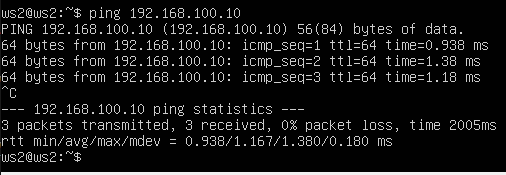
* пропинговка ws2
## Part 3. Утилита iperf3  

3.1. Перевод единиц скорости
* 8 Mbps = 1 MB/s
* 100 MB/s = 800,000 Kbps
* 1 Gbps = 1000 Mbps  

3.2. Утилита iperf3
- 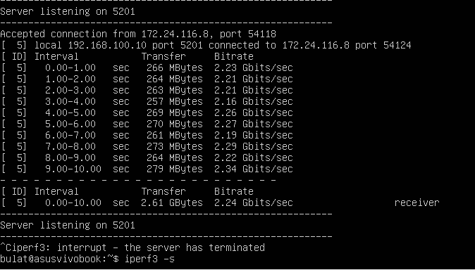
* используем ws1 как сервер
- 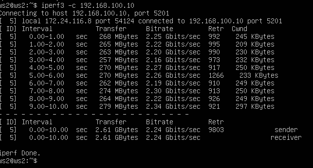
* запускаем тест на скорость соединения на ws2
## Part 4. Сетевой экран
- 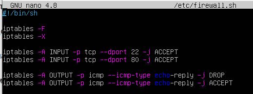
* содержание файла /etc/firewall ws1
- 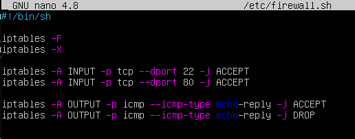
* содержание файла /etc/firewall ws2
- 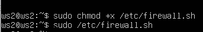
* запуск команд на ws2
- 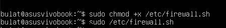
* запуск команд на ws1 
- Разница между стратегиями
* Параметр:	ws1 (запрет → разрешение) |--| ws2 (разрешение → запрет)
* Порядок правил:	DROP → ACCEPT |--| ACCEPT → DROP
* Итоговое поведение:	Запрещает echo reply |--| Разрешает echo reply
* Почему:	Первое правило DROP |--| Первое правило ACCEPT  

4.2. Утилита nmap
- 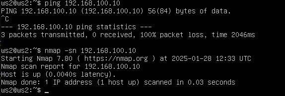
* вызов nmap
## Part 5. Статическая маршрутизация сети
5.1. Настройка адресов машин
- 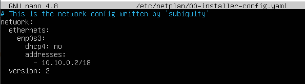
* содержание файла etc/netplan/00-installer-config.yaml ws11
- 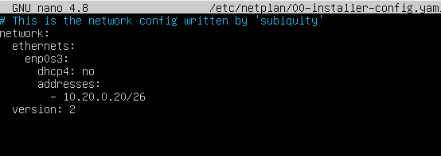
* содержание файла etc/netplan/00-installer-config.yaml ws22
- 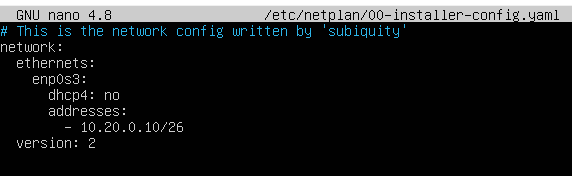
* содержание файла etc/netplan/00-installer-config.yaml ws21
- 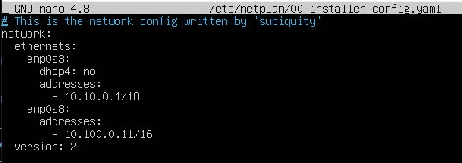
* содержание файла etc/netplan/00-installer-config.yaml r1
- 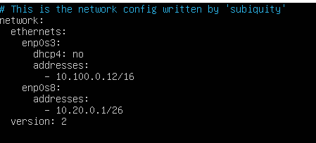
* содержание файла etc/netplan/00-installer-config.yaml r2
- 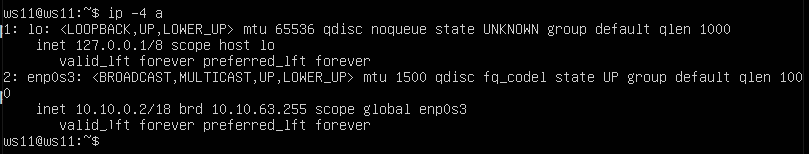
* вызов и вывод использованных команд ws11
- 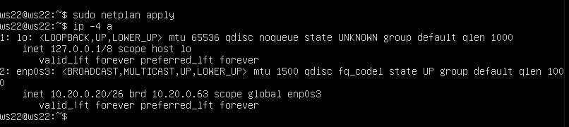
* вызов и вывод использованных команд ws22
- 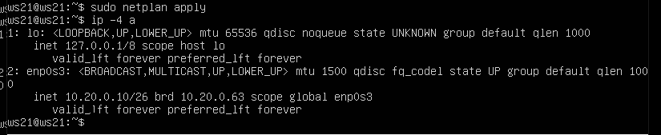
* вызов и вывод использованных команд ws21
- 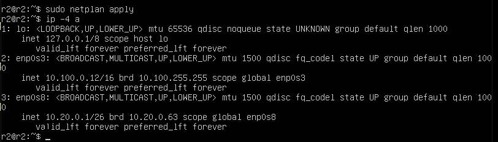
* вызов и вывод использованных команд r1
- 
* вызов и вывод использованных команд r2  

5.2. Включение переадресации IP-адресов
- 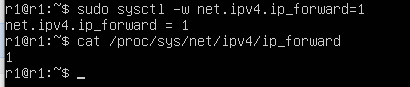
*  вызов команды sysctl -w net.ipv4.ip_forward=1 r1
- 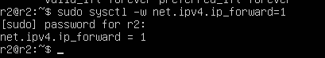
*  вызов команды sysctl -w net.ipv4.ip_forward=1 r2
- 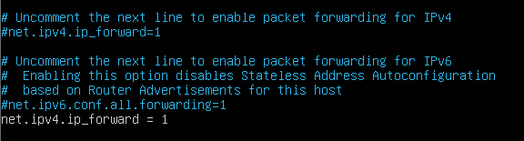
* изменение файла /etc/sysctl.conf r1
- 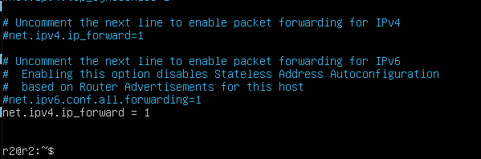
* изменение файла /etc/sysctl.conf r2  

5.3. Установка маршрута по умолчанию
- 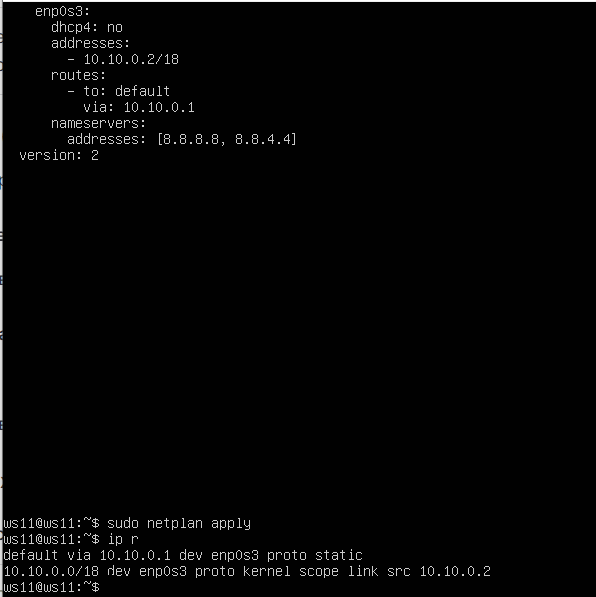
* изменение файла конфигурации и добавление в таблицу маршрутизации для ws11
- 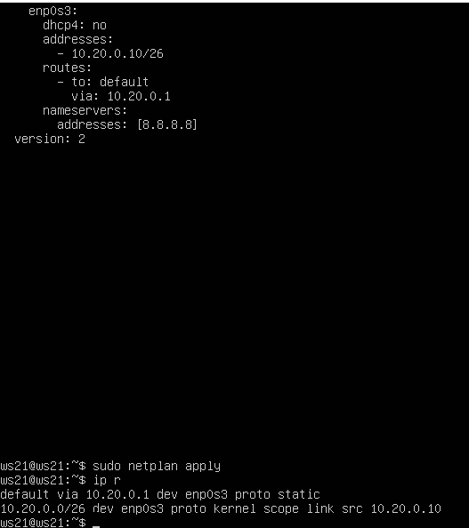
* изменение файла конфигурации и добавление в таблицу маршрутизации для ws21
- 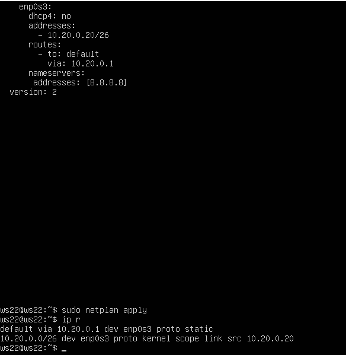
* изменение файла конфигурации и добавление в таблицу маршрутизации для ws22  

5.4. Добавление статических маршрутов
- 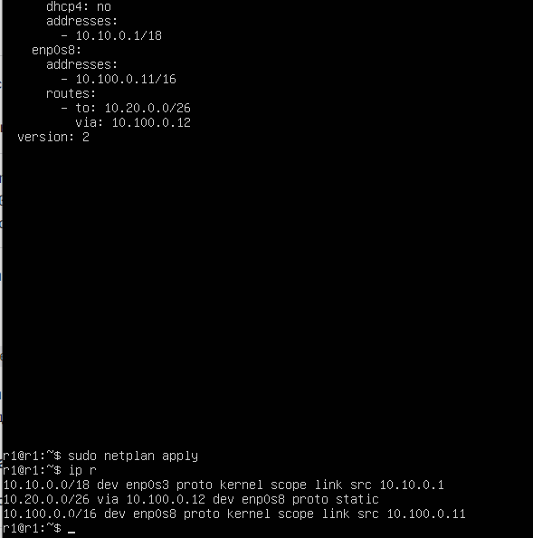
* изменение файла etc/netplan/00-installer-config.yaml и вызов ip r r1
- 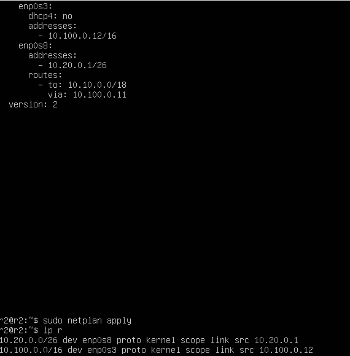
* изменение файла etc/netplan/00-installer-config.yaml и вызов ip r r2
- 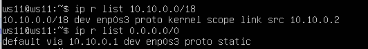
* вызов команды на ws11  

5.5. Построение списка маршрутизаторов
- 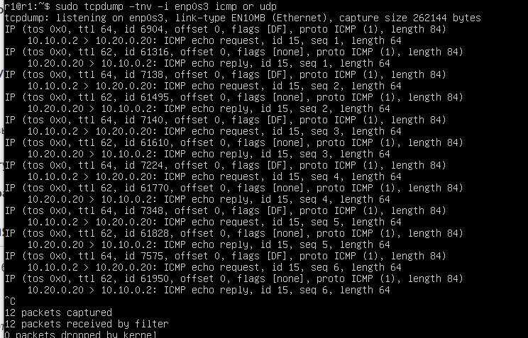
- 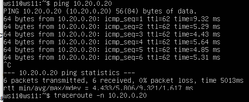
* скрины с вызовом и выводом использованных команд (tcpdump и traceroute);
* Принцип работы traceroute:
* TTL (Time To Live) — значение в заголовке IP-пакета, уменьшаемое на 1 каждым маршрутизатором на пути.
* Шаг 1: Пакет с TTL=1 отправляется к цели. Первый маршрутизатор (r1) уменьшает TTL до 0 и отправляет ICMP Time Exceeded.
* Шаг 2: Пакет с TTL=2 достигает второго маршрутизатора (r2), который также отправляет ICMP Time Exceeded.
* Шаг 3: Пакет с TTL=3 доходит до конечного узла (ws21), который отвечает ICMP Echo Reply.
* Таким образом, traceroute определяет путь, анализируя ответы от промежуточных узлов.  

5.6. Использование протокола ICMP при маршрутизации
- 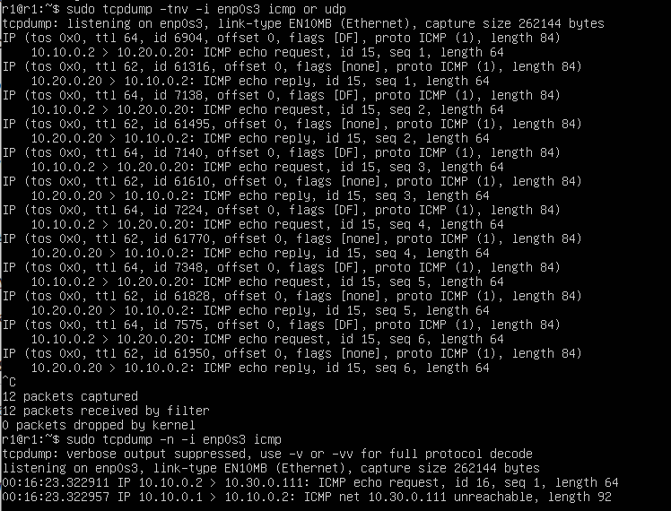
- 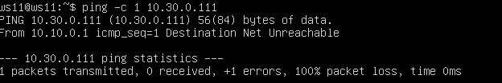
* скрины с вызовом и выводом использованных команд.
## Part 6. Динамическая настройка IP с помощью DHCP
- 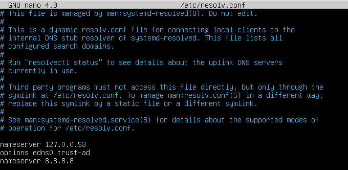
* изменненый  resolv.conf
- 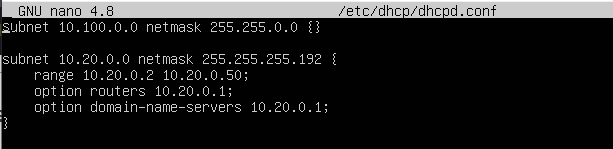
* изменненый  /etc/dhcp/dhcpd.conf
- 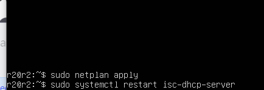
* команды на r2
- 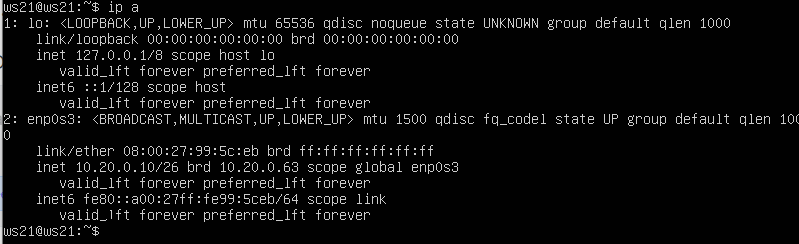
* получение адреса ws21
- 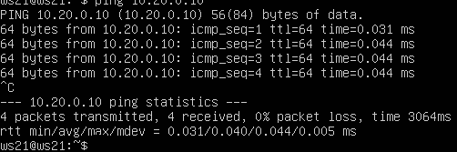
* пинг с ws22
- 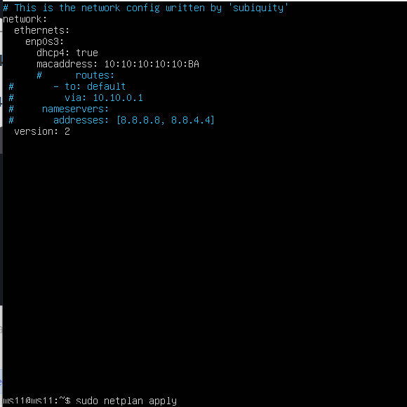
* изменение ws11
- 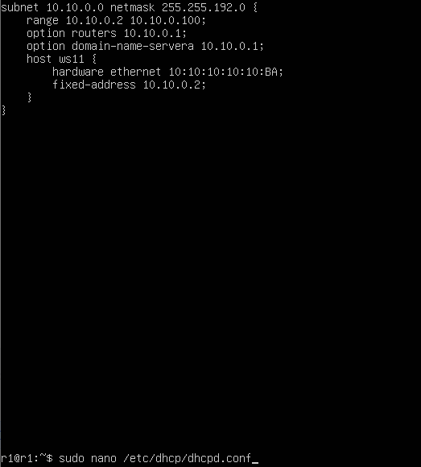
* изменение r1
- 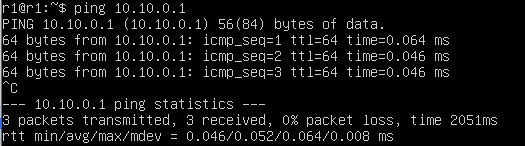
* проверка пинга r1
- 
* IP ws21
- Использованные опции DHCP-сервера:
* subnet — указание подсети (10.10.0.0/18).
* range — диапазон IP для динамической раздачи (10.10.0.10–100).
* option routers — шлюз по умолчанию (10.10.0.1).
* option domain-name-servers — DNS-сервер (8.8.8.8).
* host + hardware ethernet + fixed-address — жесткая привязка IP (10.10.0.50) к MAC-адресу (10:10:10:10:10:BA).